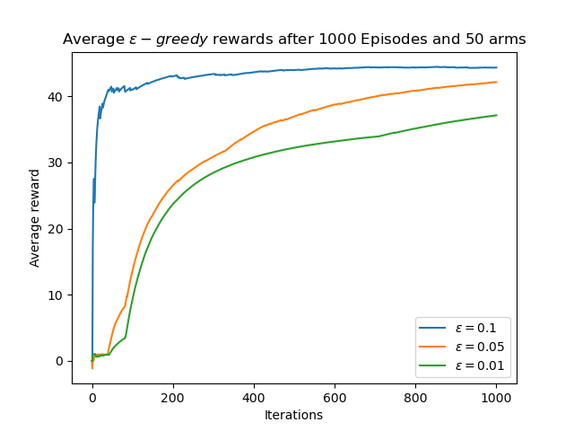

# Multi-armed bandit and the $\varepsilon$-greedy algorithm

This repo is an implementation of the $\varepsilon$-greedy algorithm applied to the multi-armed bandit (MAB) framework for reinforcement learning.

This code produce a plot for $\varepsilon \in \set{0.1, 0.05, 0.01}$.

## Results

